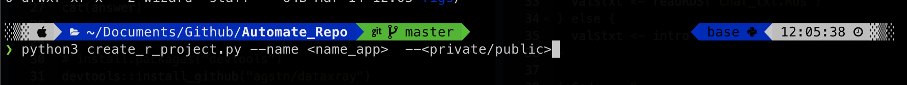

# Automate Github Repository
**IMPORTANT:** Please make sure to first setup a *Github API Token and folder path* before running the application.

# Overview
Create a Github repository or R Project automatically using your command line.

## Preview
